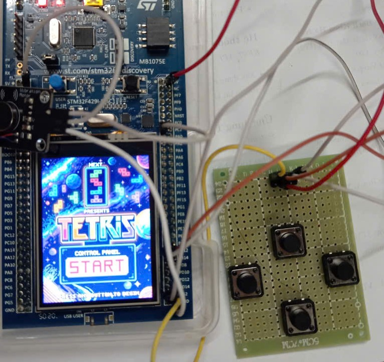
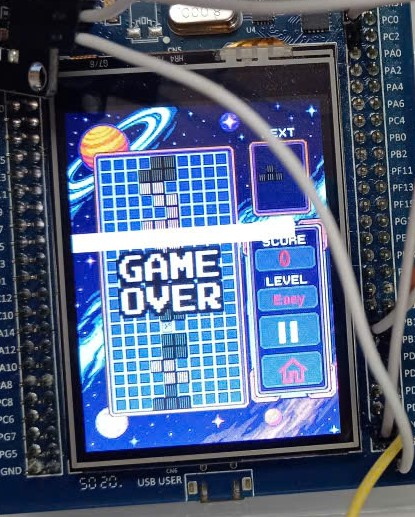
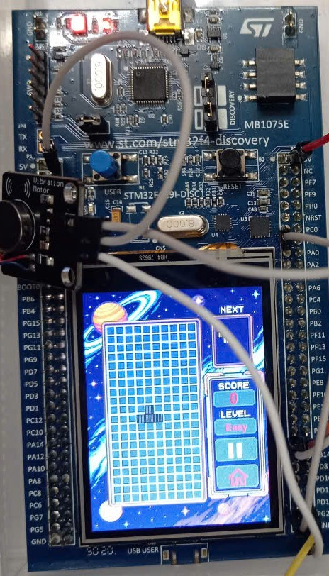
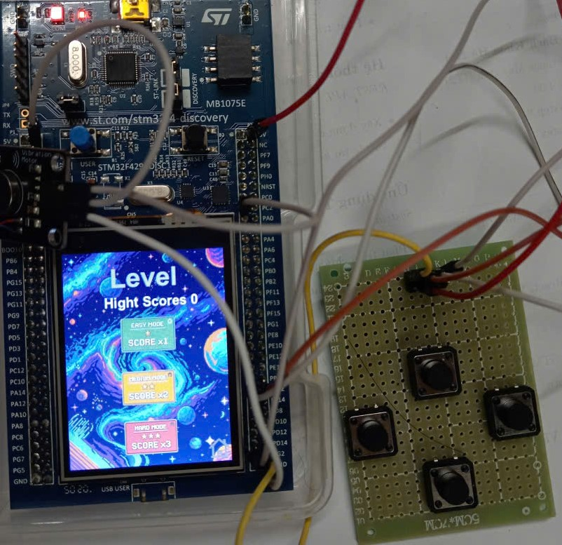

## GIỚI THIỆU

__Đề bài__: Game Tetris

__Sản phẩm:__
1. Hiển thị giao diện trò chơi với màn hình TFT 240x320 thông qua bộ điều khiển LTDC của board
2. Điều khiển trò chơi bằng phím cứng bên ngoài: cho phép di chuyển các khối sang trái/phải, xoay, rơi
3. Quản lý lưới, phát hiện va chạm,tạm dừng trò chơi, quay về trang chủ, kiểm tra và xóa hàng đầy
4. Chia cấp độ trò chơi với 3 mức easy, medium, hard mỗi cấp độ có tốc độ khác nhau và mức độ điểm khác nhau
5. Hiển thị điểm số, ghi điểm số cao nhất vào flash

![Ảnh minh họa dự án Tetris Game với STM32]
## Demo



## TÁC GIẢ
- Tên nhóm:bốn anh tài
- Thành viên trong nhóm

|STT|Họ tên|MSSV|Công việc|
  |--|--|--|--|
  | 1 | Trịnh Hải Bình | 20235376 | Thiết kế logic game, thiết kế sơ bộ giao diện, bước đầu thiết kế game |
  | 2 | Lê Công Dũng | 20235300 | Thiết kế giao diện game, xử lý các ngắt, flash |
  | 3 | Trần Viết Linh | 20235364 | Phát triển logic tạo khối ngẫu nhiên, di chuyển khối, đổi màu khối |
  | 4 | Đào Quốc Đại | 20235290 | Xử lý ngắt, xử lý chế độ rung, logic tích điểm, phát triển logic game |
  

## MÔI TRƯỜNG HOẠT ĐỘNG

- Vi điều khiển STM32F429ZIT6
- Bộ kit STM32F429ZIT6 được tích hợp cảm biến, màn hình cảm ứng
- Module rung để thực hiện việc báo hiệu khi có hàng đã được ăn
- 4 nút nhấn đơn phục vụ cho việc điều khiển khi chơi game


### TÍCH HỢP HỆ THỐNG

* Phần cứng
|Thành phần|Vai trò|
  |--|--|
  |STM32F429ZIT6|Bo mạch điều khiển chính, xử lý toàn bộ logic game và giao tiếp phần cứng|
  |Màn hình LCD|Hiển thị giao diện trò chơi Tetris và nhận thao tác Start qua cảm ứng|
  |4 nút nhấn|Cung cấp tín hiệu điều khiển trò chơi (di chuyển khối Tetris, xoay, thả nhanh)|
  |Breadboard + dây nối	|Dùng để tạo mạch kết nối phần cứng giữa các thiết bị ngoại vi|

* Phần mềm
|Thành phần|Vai trò|
  |--|--|
  |Firmware chính(C/C++)|Xử lý logic cốt lõi của game và điều kiển việc giao tiếp với các nút bấm|
  |TouchGFX|Nền tảng được sử dụng để thiết kế giao diện đồ họa cho game|
  |STM32CubeIDE|Đóng vai trò là môi trường phát triển, biên dịch và nạp chương trình|

### ĐẶC TẢ HÀM

*__[main.c](./Core/Src/main.c)__*
* ```C
  //hàng đợi phục vụ cho việc di chuyển các khối
  osMessageQueueId_t movingQueueHandle;

  //hàng đợi cho set level
  osMessageQueueId_t levelQueueHandle;
  ```
* ```C
    /**
     MovingTask chờ sự kiện bấm nút để xử lý
    */
    void MovingTask(void *argument){
        for(;;){
            // Chờ cờ 0x01 được set (chuyển sang trạng thái block)
            uint32_t evt = osThreadFlagsWait(0x01, osFlagsWaitAny, osWaitForever);

            if (evt & 0x01)
            {
                if (last_button != 0)
                {
                    if(osMessageQueueGetCount(movingQueueHandle) < 1){
                        // Nếu queue chưa có phần tử -> gửi nút bấm vào queue
                        osMessageQueuePut(movingQueueHandle, &last_button, 0, 10);
                    }
                    last_button = 0; // reset trạng thái nút
                }
            }
        }
    }

  ```
* ```C
    /**
     HAL_GPIO_EXTI_Callback xử lý các sự kiện khi người dùng bấm nút 
    */
    void HAL_GPIO_EXTI_Callback(uint16_t GPIO_Pin) { //Mã định danh của chân GPIO gây ra ngắt
        static uint32_t last_time = 0;
        if(GPIO_Pin == GPIO_PIN_0){
            // Đây là nút đặc biệt → phát nhạc qua DFPlayer
            DF_SendCommand(0x19, 0x00, 0x00);
            HAL_GPIO_TogglePin(GPIOG, GPIO_PIN_13);
        }
        else{
            // chống rung phím trong 200ms
            if(HAL_GetTick() - last_time < 200) return;
            last_time = HAL_GetTick();
            // xác định nút nào đang được bấm
            char res = 0;
            switch (GPIO_Pin)
            {
                case GPIO_PIN_12:
                    res = 'L';	// Trái
                    break;
                case GPIO_PIN_13:
                    res = 'R';	// Phải
                    break;
                case GPIO_PIN_2:
                    res = 'T';	// Xoay
                    break;
                case GPIO_PIN_3:
                    res = 'D';	// Rơi nhanh
                    break;
                default:
                    return;
            }
        }
    }
  ```
*__[Screen2View.cpp](TouchGFX/gui/src/screen2_screen/Screen2View.cpp)__*
* ```C
  /**
   Các hàm xử lý chọn chế độ cho người dùng có 3 mức độ dễ bình thường và khó
   */
  void Screen2View::easyBtn();
  void Screen2View::mediumBtn();
  void Screen2View::hardBtn();
  ```
*__[Screen3View.hpp](TouchGFX/gui/include/gui/screen3_screen/Screen3View.hpp)__*
* ```C
  /*Các thuộc tính của Screen3View*/
  TetrisEngine engine;              //game engine
  BoxWithBorder colBoxes[20][10];   //lưới box chính hiển thị
  BoxWithBorder previewBoxes[4][4]; //next box
  int tickCount;                    //biếm đếm
  bool musicGameOver;               //trạng thái music game over
  uint8_t level;                    //level game
  ```
*__[Screen3View.cpp](TouchGFX/gui/src/screen3_screen/Screen3View.cpp)__*
* ```C
   static void convertRGB565ToRGB888(uint16_t rgb565, uint8_t& r, uint8_t& g, uint8_t& b) {
    r = ((rgb565 >> 11) & 0x1F) << 3; // 5-bit red => 8-bit
    g = ((rgb565 >> 5) & 0x3F) << 2;  // 6-bit green => 8-bit
    b = (rgb565 & 0x1F) << 3;         // 5-bit blue => 8-bit
  ```
* ```C
   /**
    Xử lý giao diện bộ khung hiển thị game với tọa độ lưới định danh bởi 5 giá trị
    */
    Screen3View::Screen3View() {
	int gridOffsetX = 29;   // tọa độ X góc trên-trái của khung lưới
	int gridOffsetY = 46;   // tọa độ Y góc trên-trái của khung lưới
	int cellSize = 12; // kích thước mỗi ô 
	gamePaused = false;
	for (int y = 0; y < GRID_HEIGHT; y++) {
		for (int x = 0; x < GRID_WIDTH; x++) {
			int px = gridOffsetX + x * cellSize;
			int py = gridOffsetY + y * cellSize;
			....
		}
	}
    ....
	//khởi tạo lưới để hiện thị next block. Hiển thị hình ảnh các khối tiếp theo để người dùng đoán trước lựa chọn
	int previewX = 177;
	int previewY = 60;
	for (int y = 0; y < 4; y++) {
		for (int x = 0; x < 4; x++) {
			...
		}
	}
	...
	// Đưa ra các mức độ chơi để người dùng chơi
	const char *levelName = "Easy";
	...
	}
}
```
* ```C
// Vẽ block đang rơi
void Screen3View::drawGrid() {
//    const auto& grid = engine.getGrid();
	const auto &block = engine.getCurrentBlock();
	int currX = engine.getCurrX();
	int currY = engine.getCurrY();
	// --- VẼ LƯỚI CHÍNH ---
	for (int y = 0; y < GRID_HEIGHT; ++y) {
		for (int x = 0; x < GRID_WIDTH; ++x) {
			...
	}
	// Vẽ block đang rơi
	int currType = engine.getCurrentBlockType();  // Lấy ID loại gạch (0 đến 10)
	uint16_t blockColor = engine.getCurrentBlockColor(); // Lấy mã màu thực tế (0xF800...)
	uint8_t r, g, b;
	convertRGB565ToRGB888(blockColor, r, g, b); // Truyền đúng mã màu vào hàm convert
	...
	// hàm tạm dừng trò chơi
	void Screen3View::pauseBtn() {
	gamePaused = flexButton2.getPressed();
}
}
  ```
  /**
*__[TetrisEngine.cpp](STM32CubeIDE/Application/User/TetrisEngine.cpp)__*
* ```C
   /**
    Khởi tạo giá trị ban đầu cho các thuộc tính, tạo khối mới
    */
    void TetrisEngine::init() {
        //Khởi tạo giá trị ban đầu cho grid
        ...
        // Dùng cho tạo khối tiếp theo
        ...
        //random khối mới
        spawnBlock();
    }
  ```
* ```C
   /**
    Tạo khối mới và color cho khối các khối có khả năng rơi ra là 85% và 15% là đạo cụ đặc biệt
    */
    void TetrisEngine::generateNextBlock() {
        nextBlockId = osKernelGetTickCount() % 7;	//lấy next box (7 loại) dựa trên tick hệ thống
        
        ...
  ```
* ```C
   /**
    Get next block (gán nextBlock, size nextBlock và color cho tham số truyền vào)
    @param	block: BlockMatrix& khối cần thay đổi
    @param	size: int& biểu diễn kích thước của khối
    @param	color: uint16_t& biểu diễn màu của khối
    */
    void TetrisEngine::getNextBlock(BlockMatrix& block, int& size, uint16_t& color) const {
        block = nextBlock;
        size = nextBlockSize;
        color = ColorPallette[nextBlockColor];
    }
  ```  
* ```C
  void TetrisEngine::lockBlock() {
    //  Kiểm tra xem có phải là đạo cụ đặc biệt không (Bom, Clear Col, Clear Row)
    if (currBlockColor >= 7 && currBlockColor <= 9) {
        // Thực thi hiệu ứng
        if (currBlockColor == 7) { // 7: Bom nổ 3x3
            for...
                        grid[ny][nx] = 0; // Clear ô
                    }
                }
            }
        }
        else if (currBlockColor == 8) { // 8: Clear cột
            for (int y = 0; y < GRID_HEIGHT; y++) {
                grid[y][itemX] = 0;
            }
        }
        else if (currBlockColor == 9) { // 9: Clear hàng
            for (int x = 0; x < GRID_WIDTH; x++) {
                grid[itemY][x] = 0;
            }

        }
        takeScore = true; // Kích hoạt còi báo hiệu ăn điểm
        score += point;
    }
    else {// 2. Nếu là khối bình thường hoặc Khối Đá (10) thì cố định vào Grid
        for (int i = 0; i < blockSize; ++i) {
            for (int j = 0; j < blockSize; ++j) {
                ...
                    if (gy >= 0 && gy < GRID_HEIGHT && gx >= 0 && gx < GRID_WIDTH) {
                        grid[gy][gx] = currBlockColor + 1; // +1 để khác 0
                    }
                }
            }
        }
    }
    // --- CHU TRÌNH RỤNG VÀ QUÉT HÀNG CHUẨN ---
            bool actionHappened;
            ...
}
```
* ```C
   /**
   	Gán khối mới cho khối hiện tại
    */
    void TetrisEngine::spawnBlock() {
        ...
    }
  ```
* ```C
   /**
    Xoay 90 độ
    @param BlockMatrix& thể hiện khối 4x4 cần xoay
    */
    void TetrisEngine::rotateMatrix(BlockMatrix& mat) {
        ...
    }
  ```
* ```C
   /**
    Lấy đường biên của block (hình chữ nhật nhỏ nhất chứa được toàn bộ block)
    @param	block: BlockMatrix& khối cần lấy đường biên
    @param	minX: int& lưu tọa độ x nhỏ nhất
    @param	maxX: int& lưu tọa độ x lớn nhất
    @param	minY: int& lưu tọa độ y nhỏ nhất
    @param	maxY: int& lưu tọa độ y lớn nhất
    */
    // Tìm vùng bao quanh một khối teris
    void TetrisEngine::getBlockBounds(const BlockMatrix& block, int& minX, int& maxX, int& minY, int& maxY) {
       ...
    }
  ```
* ```C
   /**
    Kiểm tra va trạm của khối với tọa độ (x, y) mới
    @param	newX: int mô tả tọa độ x cần kiểm tra
    @param	newY: int mô tả tọa độ y cần kiểm tra
    @param	block: BlockMatrix& khối cần kiểm tra
    @retval	boolean True - va chạm, False - không va chạm
    */
    bool TetrisEngine::checkCollision(int newX, int newY, const BlockMatrix& block) {
        int minX, maxX, minY, maxY;

        //lấy bao ngoài của block
        getBlockBounds(block, minX, maxX, minY, maxY);
        for (int i = minY; i <= maxY; ++i)
            for (int j = minX; j <= maxX; ++j)
                if (block[i][j]) {
                    int gx = newX + j;
                    int gy = newY + i;

                    //ra ngoài hoặc ô đã được đặt -> va chạm -> return true
                    if (gx < 0 || gx >= GRID_WIDTH || gy < 0 || gy >= GRID_HEIGHT) return true;
                    if (grid[gy][gx]) return true;
                }
        return false;
    }
  ```
* ```C
   /**
    Cố định lại block trên lưới và tạo khối mới
    */
    void TetrisEngine::lockBlock() {
        for (int i = 0; i < blockSize; ++i)
            for (int j = 0; j < blockSize; ++j)
                if (currBlock[i][j]) {
                    int gx = currX + j;
                    int gy = currY + i;
                    if (gy >= 0 && gy < GRID_HEIGHT && gx >= 0 && gx < GRID_WIDTH)
                        grid[gy][gx] = currBlockColor + 1;
                }

        //xóa đường nếu full + gen khối mới
        clearLines();
        spawnBlock();
    }
  ```
* ```C
   /**
    Xóa line nếu cả hàng đã full và tính điểm
    */
    void TetrisEngine::clearLines() {
        //kiểm tra các hàng từ dưới lên trên
        for (int y = GRID_HEIGHT - 1; y >= 0; --y) {
            bool full = true;
            for (int x = 0; x < GRID_WIDTH; ++x)
                if (!grid[y][x]) full = false; //-> có 1 ô chưa được đánh dấu -> chưa đầy hàng

            if (full) {
                takeScore = true; //đánh dấu được tăng điểm -> bật buzzer sau đó
                score++; //tăng điểm
                for (int row = y; row > 0; --row)
                    grid[row] = grid[row - 1];
                grid[0].fill(0);
                ++y; // re-check this row
            }
        }
    }
  ```
* ```C
   /**
    Check va chạm + khóa khối nếu được
    */
    void TetrisEngine::update() {
       ...
    }
  ```
* ```C
   /**
    Di chuyển block sang trái
    */
    void TetrisEngine::moveLeft() {
        ...
    }
  ```
* ```C
   /**
    Di chuyển block sang phải
    */
    void TetrisEngine::moveRight() {
        ...
    }
  ```
* ```C
   /**
 	Thả block
    */
    void TetrisEngine::drop() {
        if(gameOver) return;
        //kiểm tra trước khi di chuyển
        while (!checkCollision(currX, currY + 1, currBlock)) currY++;
        lockBlock();
    }
  ```
* ```C
   /**
    Xoay block sang phải 1 lần
    */
    void TetrisEngine::rotate() {
       ...
    }
  ```
* ```C
   /**
    Lấy màu của khối đang rơi
    @retval	uint16_t màu của khối
    */
    uint16_t TetrisEngine::getCurrentBlockColor() const {
        return ColorPallette[currBlockColor];
    }
  ```
* ```C
   /**
    Lấy màu của lưới
    @param	x: int biểu diễn tọa độ cần lấy màu
    @param	y: int biểu diễn tọa độ cần lấy màu
    @retval	uint16_t màu của ô
    */
    uint16_t TetrisEngine::getGridColor(int x, int y) const {
        if(grid[y][x] == 0) return 0x0000;
        return ColorPallette[grid[y][x] - 1];
    }
  ```
### KẾT QUẢ

## Game Over



## Giao diện trò chơi



## Menu cấp độ



## Quá trình thực hiện

- __[Quá trình chơi trò chơi](image/finalgame.mp4)__